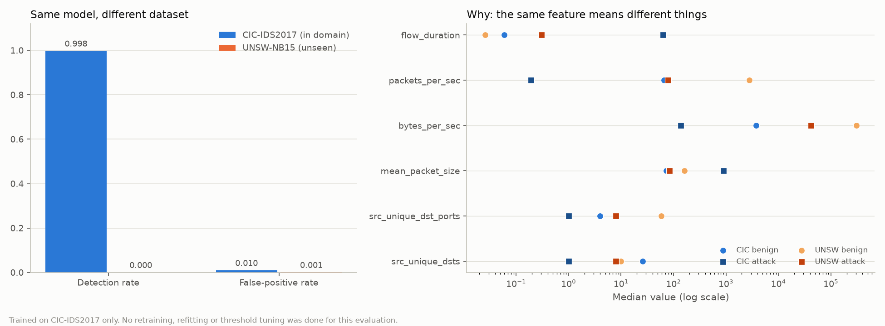

# Cross-dataset evaluation: CIC-IDS2017 -> UNSW-NB15

The lite model, its scaler and the feature code are used exactly as the live
system loads them. Nothing was retrained or refitted; only the data is new.
Generated by `python -m src.cli cross-eval`.

- Model: **lite/random_forest**, 6 features
- Scored: **2,059,415** UNSW-NB15 flows (99,643 attack, 1,959,772 benign) in 2.9 s
- Counted as flagged: any non-benign class at confidence >= 0.6

## Headline: does it transfer?

| Measure | CIC-IDS2017 (in domain) | UNSW-NB15 (unseen) |
|---|---|---|
| Detection rate | 0.9976 | **0.0003** |
| False-positive rate | 0.00965 | **0.00061** |

29 of 99,643 attack flows flagged; 1,203 of 1,959,772 benign flows wrongly flagged.

## By attack category

Seven of the ten UNSW-NB15 categories describe attacks that have no class in
Netra's label set, so for those the only meaningful question is whether the
flow was flagged as *something*, not whether it was named correctly.

| UNSW category | Flows | Flagged | Netra class | Most often predicted |
|---|---|---|---|---|
| normal | 1,959,772 | 0.1% | Benign | Benign 100%, DoS-Slow 0%, DDoS 0% |
| exploits | 27,599 | 0.0% | (no equivalent) | Benign 100%, Bot 0% |
| generic | 25,378 | 0.0% | (no equivalent) | Benign 100% |
| fuzzers | 21,795 | 0.1% | (no equivalent) | Benign 100%, Bot 0% |
| reconnaissance | 13,357 | 0.0% | PortScan | Benign 100% |
| dos | 5,665 | 0.0% | DoS | Benign 100%, Bot 0% |
| analysis | 2,184 | 0.0% | (no equivalent) | Benign 100% |
| backdoor | 1,983 | 0.1% | (no equivalent) | Benign 100%, Bot 0% |
| shellcode | 1,511 | 0.2% | (no equivalent) | Benign 100%, Bot 0% |
| worms | 171 | 0.0% | (no equivalent) | Benign 100% |

### Categories with a direct Netra equivalent

| UNSW category | Netra class | Flows | Named correctly | Flagged at all |
|---|---|---|---|---|
| dos | DoS | 5,665 | 0.0% | 0.0% |
| reconnaissance | PortScan | 13,357 | 0.0% | 0.0% |

## Confidence threshold sweep

| Minimum confidence | Detection rate | False-positive rate |
|---|---|---|
| 0.0 | 0.0004 | 0.00071 |
| 0.5 | 0.0004 | 0.00069 |
| 0.6 | 0.0003 | 0.00061 |
| 0.7 | 0.0002 | 0.00060 |
| 0.8 | 0.0000 | 0.00000 |
| 0.9 | 0.0000 | 0.00000 |

## Byte-accounting sensitivity

CIC-IDS2017 counts transport payload bytes; UNSW-NB15 counts whole packets
including headers. Subtracting an estimated 40 header bytes per packet
approximates payload and isolates how much of the result is caused by that
mismatch rather than by the traffic itself.

| Byte accounting | Detection rate | False-positive rate |
|---|---|---|
| As published (with headers) | 0.0003 | 0.00061 |
| Header-corrected (approx. payload) | 0.0002 | 0.00002 |

## Why it fails: the features do not mean the same thing

Median value of each feature, by dataset and by class. The model was not
asked to generalise to new attacks; it was asked to extrapolate to a network
whose ordinary traffic sits where its training data put attacks.

| Feature | CIC benign | CIC attack | UNSW benign | UNSW attack | benign shift |
|---|---|---|---|---|---|
| flow_duration | 0.06 | 63.12 | 0.03 | 0.30 | 0.4x |
| packets_per_sec | 65.53 | 0.19 | 2,775.12 | 79.22 | 42.3x |
| bytes_per_sec | 3,762.30 | 138.07 | 304,559.25 | 41,890.12 | 81.0x |
| mean_packet_size | 73.00 | 897.15 | 161.00 | 84.00 | 2.2x |
| src_unique_dst_ports | 4.00 | 1.00 | 59.00 | 8.00 | 14.8x |
| src_unique_dsts | 26.00 | 1.00 | 10.00 | 8.00 | 0.4x |

The decisive row is `packets_per_sec`. In CIC-IDS2017 a benign flow runs at
about 66 packets/s and attack flows are far slower, so the model learned that
low rates are suspicious. In UNSW-NB15 ordinary traffic runs two orders of
magnitude faster, and its *attacks* sit at roughly the rate CIC-IDS2017 calls
normal. The learned boundary is not merely in the wrong place, it points the
wrong way.

