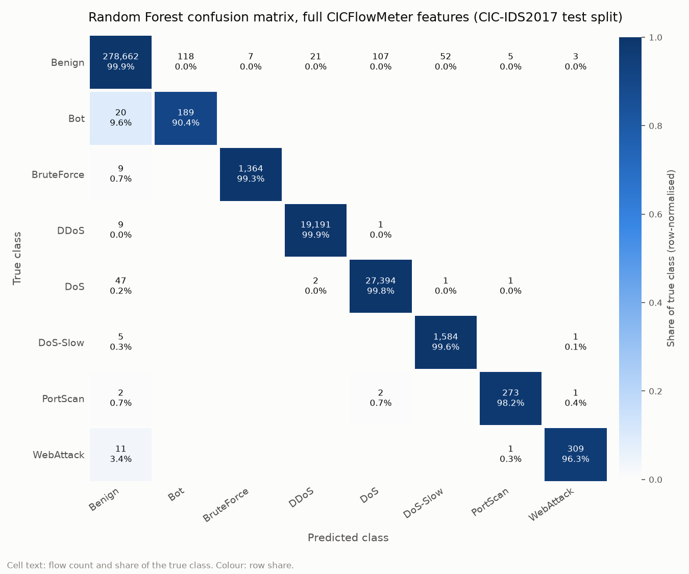
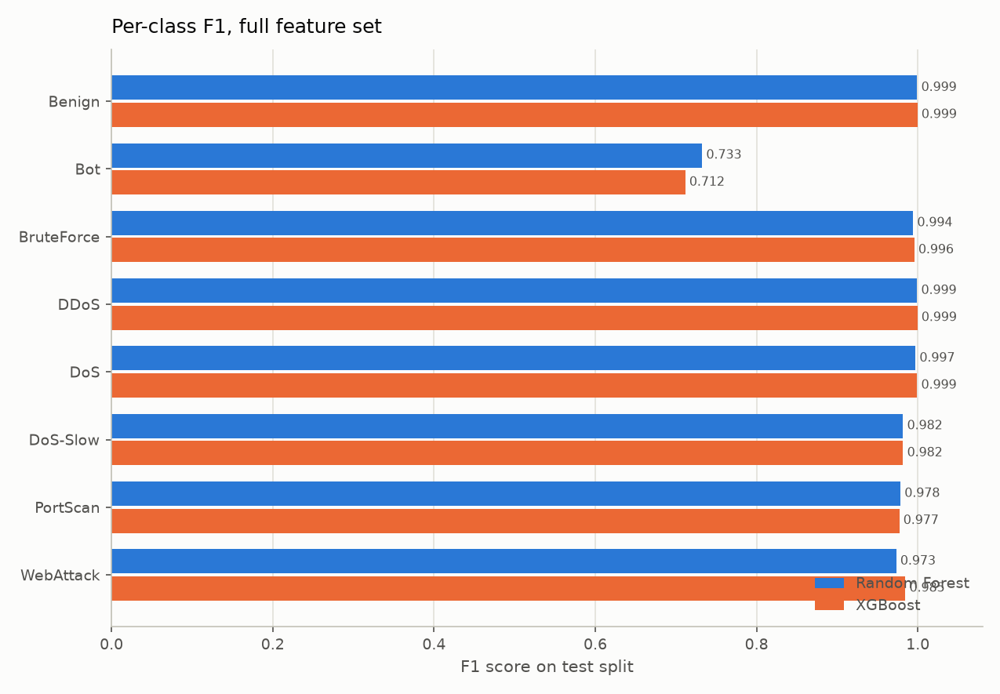
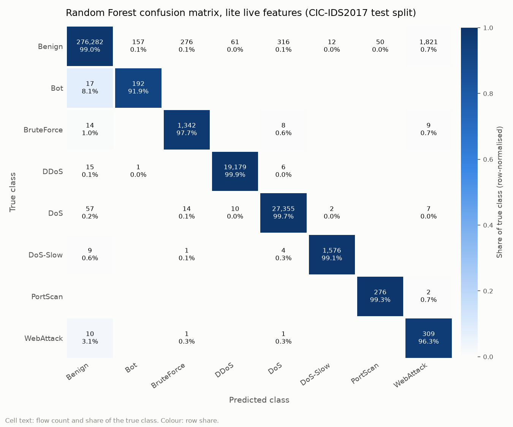
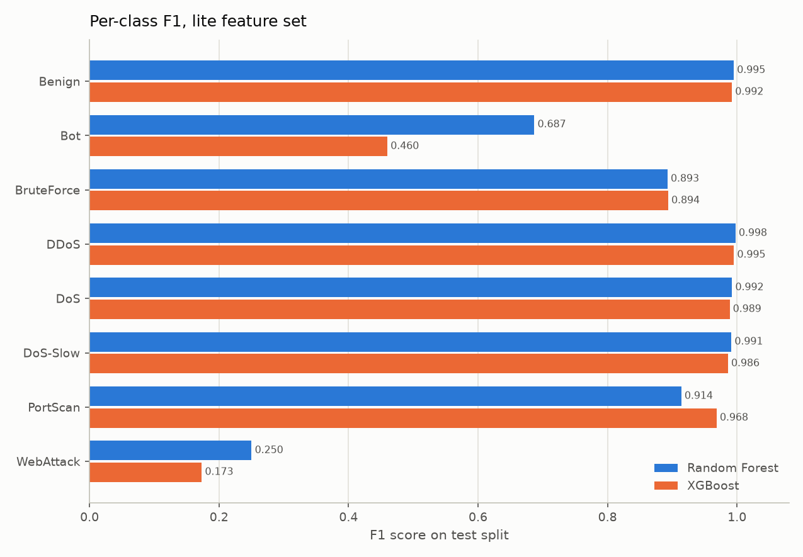
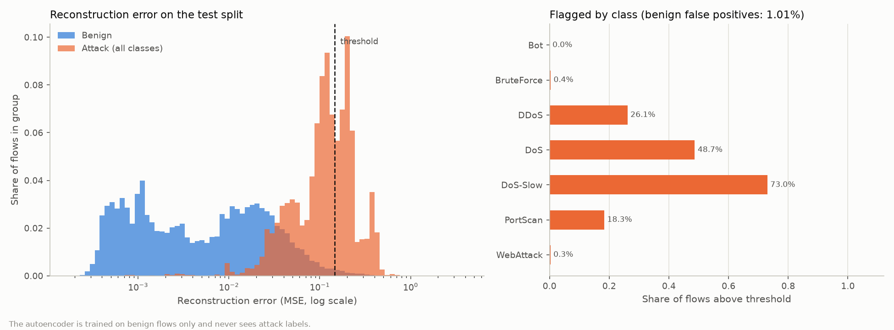

# Netra evaluation results

All values are measured on the held-out CIC-IDS2017 test split, which keeps the
natural class distribution. Generated by `python -m src.cli evaluate`.

## Full CICFlowMeter feature set (59 features)

Selected model (by validation macro F1): **Random Forest**

| Model | Accuracy | Macro P | Macro R | Macro F1 | Weighted F1 | ROC-AUC (OvR macro) | Detection rate | False-positive rate | Train time (s) | Inference (us/flow) |
|---|---|---|---|---|---|---|---|---|---|---|
| Random Forest | 0.9987 | 0.9415 | 0.9794 | 0.9570 | 0.9987 | 0.9999 | 0.9980 | 0.00112 | 31 | 2.51 |
| XGBoost | 0.9990 | 0.9316 | 0.9957 | 0.9561 | 0.9991 | 1.0000 | 0.9997 | 0.00102 | 96 | 5.20 |

Per-class results for Random Forest:

| Class | Precision | Recall | F1 | Test flows |
|---|---|---|---|---|
| Benign | 0.9996 | 0.9989 | 0.9993 | 278,975 |
| Bot | 0.6156 | 0.9043 | 0.7326 | 209 |
| BruteForce | 0.9949 | 0.9934 | 0.9942 | 1,373 |
| DDoS | 0.9988 | 0.9995 | 0.9991 | 19,201 |
| DoS | 0.9960 | 0.9981 | 0.9971 | 27,445 |
| DoS-Slow | 0.9676 | 0.9962 | 0.9817 | 1,590 |
| PortScan | 0.9750 | 0.9820 | 0.9785 | 278 |
| WebAttack | 0.9841 | 0.9626 | 0.9732 | 321 |

Attack-versus-benign view: 50,314 of 50,417 attack flows flagged, 313 of 278,975 benign flows wrongly flagged.

## Lite live feature set (6 features)

Selected model (by validation macro F1): **Random Forest**

| Model | Accuracy | Macro P | Macro R | Macro F1 | Weighted F1 | ROC-AUC (OvR macro) | Detection rate | False-positive rate | Train time (s) | Inference (us/flow) |
|---|---|---|---|---|---|---|---|---|---|---|
| Random Forest | 0.9913 | 0.7919 | 0.9786 | 0.8400 | 0.9934 | 0.9995 | 0.9976 | 0.00965 | 17 | 2.52 |
| XGBoost | 0.9862 | 0.7643 | 0.9873 | 0.8071 | 0.9904 | 0.9998 | 0.9988 | 0.01552 | 48 | 4.91 |

Per-class results for Random Forest:

| Class | Precision | Recall | F1 | Test flows |
|---|---|---|---|---|
| Benign | 0.9996 | 0.9903 | 0.9949 | 278,975 |
| Bot | 0.5486 | 0.9187 | 0.6869 | 209 |
| BruteForce | 0.8213 | 0.9774 | 0.8926 | 1,373 |
| DDoS | 0.9963 | 0.9989 | 0.9976 | 19,201 |
| DoS | 0.9879 | 0.9967 | 0.9923 | 27,445 |
| DoS-Slow | 0.9912 | 0.9912 | 0.9912 | 1,590 |
| PortScan | 0.8466 | 0.9928 | 0.9139 | 278 |
| WebAttack | 0.1439 | 0.9626 | 0.2503 | 321 |

Attack-versus-benign view: 50,295 of 50,417 attack flows flagged, 2,693 of 278,975 benign flows wrongly flagged.

## Autoencoder anomaly detector (trained on benign flows only)

Threshold: reconstruction error above the 99th percentile of benign validation flows (0.14632).

| ROC-AUC | Average precision | Detection rate | False-positive rate | Precision |
|---|---|---|---|---|
| 0.9603 | 0.7990 | 0.3887 | 0.01005 | 0.8748 |

| Class | Test flows | Share flagged as anomalous |
|---|---|---|
| Benign | 278,975 | 0.0101 |
| Bot | 209 | 0.0000 |
| BruteForce | 1,373 | 0.0036 |
| DDoS | 19,201 | 0.2614 |
| DoS | 27,445 | 0.4868 |
| DoS-Slow | 1,590 | 0.7302 |
| PortScan | 278 | 0.1835 |
| WebAttack | 321 | 0.0031 |

